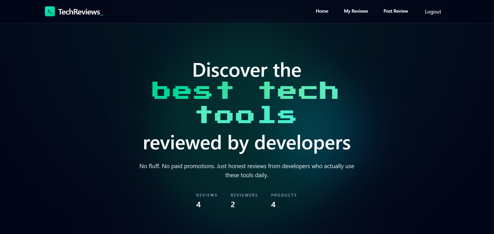

# ProductReviewProject

A modern full-stack product review platform where users can publish detailed tech reviews, browse community feedback, and discuss products through threaded comments.

## Preview



## Key Features

- User authentication (sign up, login, logout) with Appwrite
- Create, edit, and delete product reviews
- Rich text review editor powered by TinyMCE
- Product-focused metadata (category, rating, product name, featured image)
- Filter reviews by category and rating
- Personal dashboard for managing your own reviews
- Threaded comment discussions on each review
- Optional auto-image search for products via Unsplash API

## Tech Stack

### Frontend

- React 19
- Vite 7
- React Router DOM 7
- Redux Toolkit + React Redux
- Tailwind CSS 4
- React Hook Form
- TinyMCE React

### Backend & Services

- Appwrite (Auth, Database, Storage)
- Unsplash API (for product image suggestions)

## Project Structure

```text
src/
  appwrite/       # Appwrite auth/database/storage service wrappers
  components/     # Reusable UI components and forms
  pages/          # Route-level pages
  services/       # External API helpers (e.g., image search)
  store/          # Redux slices and store configuration
public/
  Screenshot.png  # App preview image used in this README
```

## Getting Started

### 1) Clone and install dependencies

```bash
git clone <your-repository-url>
cd ProductReviewProject
npm install
```

### 2) Configure environment variables

Create a `.env` file in the project root:

```env
VITE_APPWRITE_URL=
VITE_APPWRITE_PROJECT_ID=
VITE_APPWRITE_DATABASE_ID=
VITE_APPWRITE_TABLES_ID=
VITE_APPWRITE_BUCKET_ID=
VITE_APPWRITE_COMMENTS_ID=
VITE_UNSPLASH_ACCESS_KEY=
```

`VITE_UNSPLASH_ACCESS_KEY` is optional, but required to use the auto-image picker while creating reviews.

### 3) Run the app

```bash
npm run dev
```

Open the local URL shown in the terminal (usually `http://localhost:5173`).

## Available Scripts

- `npm run dev` - Start development server
- `npm run build` - Create production build
- `npm run preview` - Preview production build locally
- `npm run lint` - Run ESLint checks

## Appwrite Setup Notes

To run the project end-to-end, make sure your Appwrite project has:

- A database and collections for posts/reviews and comments
- A storage bucket for review images
- Proper permissions aligned with the app logic (public read, owner update/delete)

## License

This project is for educational and personal development purposes. Add your preferred license before production use.
